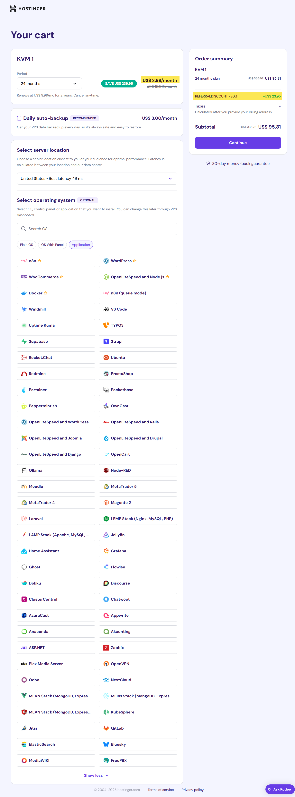

# Get your own server out in the cloud!

Get your server from a hosting provider. I have scoured the internet for the best deals and found that Hostinger offers some of the most affordable and reliable VPS hosting plans.👍👍

I personally use and recommend [Hostinger](https://www.hostinger.com/cart?product=vps%3Avps_kvm_2&period=24&referral_type=cart_link&REFERRALCODE=5Q1DARRENHDY&referral_id=01976682-6e66-7304-b8ed-ecfc07557cac). Using that link will give you an additional 20% discount on your first purchase.

---

---

>Looking to save some money? You can get a KVM1 plan for cheaper than the KVM2 plan, but it has less RAM and storage. If you are just starting out or testing things, this is a good option.

---

